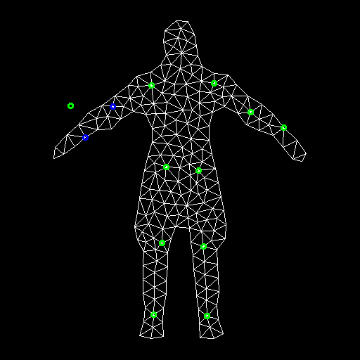
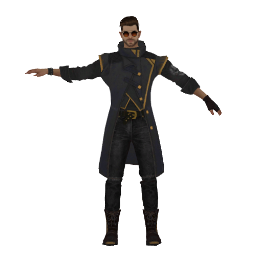

# ARAP (As-rigid-as possible) Deformation

## Features

- Construct triangular mesh from 2d Image & Mask.
- Deform the mesh following some pre-defined handle-points.
- Render the mesh using PyTorch3d.

## Entry point

```commandline
python main.py 
```

## Some results

In the `Handle points` column, Green is the target key-points, while Blue is the original key-points.

| Source image                                      | Handle points                                      | Deformed image                                      |
|---------------------------------------------------|----------------------------------------------------|-----------------------------------------------------|
|  |  |  |
